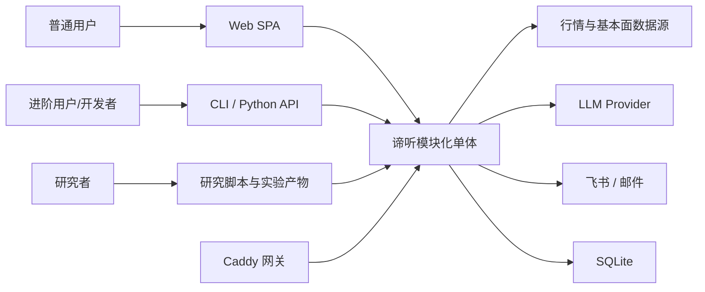
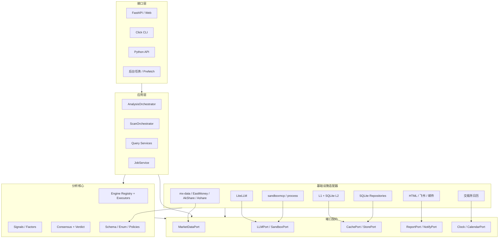
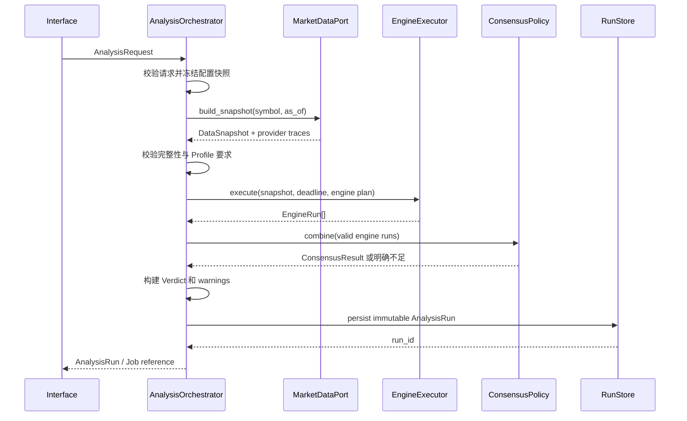
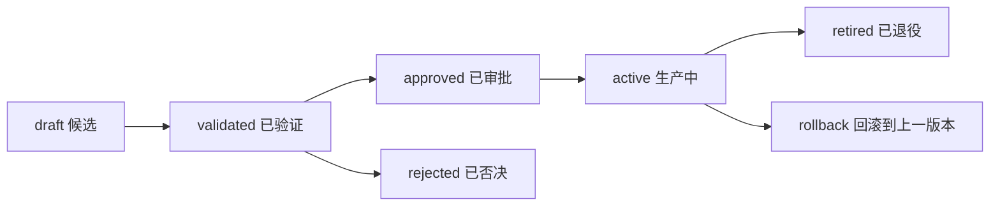
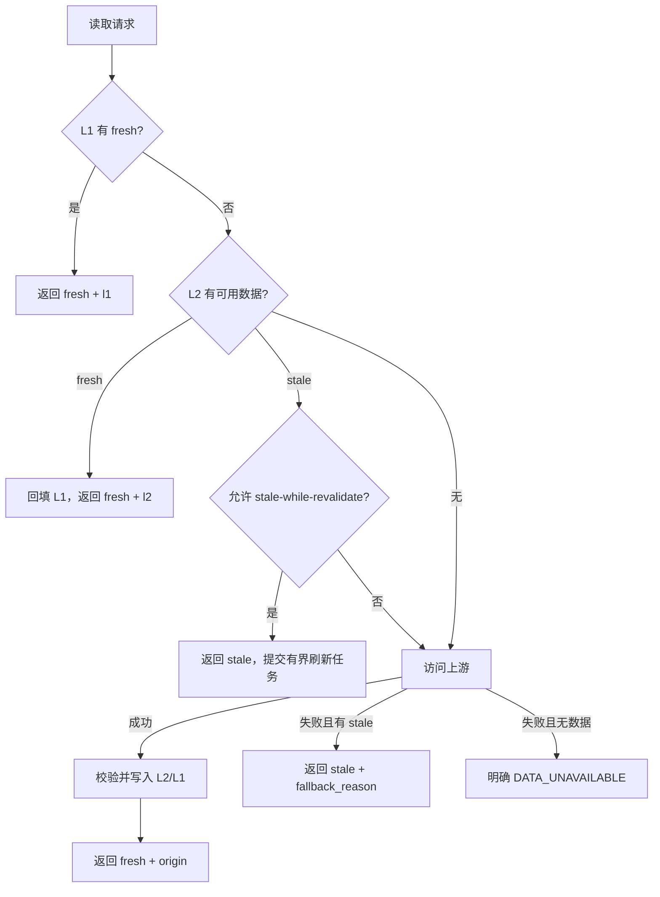
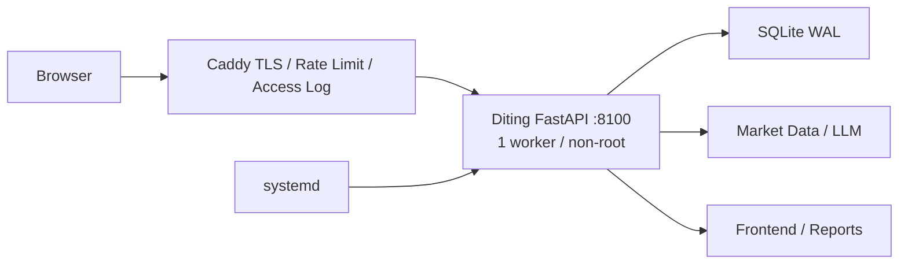

# 谛听 v0.8.0 总体设计：可信分析内核与统一应用架构

> 状态：已接受（Accepted）
> 目标里程碑：v0.8.0
> 架构版本：3.0
> 日期：2026-08-02
> 读者：项目负责人、实现代理、维护者与贡献者

---

## 0. 文档定位

本文是谛听 v0.8.0 的**目标架构基线**，回答四个问题：

1. 谛听究竟要解决什么问题，哪些事情明确不做；
2. CLI、Web、后台任务、数据源、分析引擎和研究系统如何协作；
3. 分析结论怎样做到可解释、可追溯、可降级但不伪造；
4. 当前系统如何在不中断使用的前提下迁移到目标架构。

本文是架构解释与决策记录，不是逐步操作教程。v0.8 实现状态、验证证据和仍受外部条件
约束的发布步骤分别记录在 `tasks/todo.md`、`test-results/` 与部署 How-to 中；文中的“目标”
描述设计意图，不替代运行时 OpenAPI、严格配置模型或测试证据。

### 0.1 文档优先级

本设计评审通过后，文档冲突按以下规则处理：

1. `AGENTS.md` 继续负责开发流程、角色分工和提交门禁；
2. 本文负责 v0.8.0 的系统边界、目标架构和核心决策；
3. `api-contracts.md`、OpenAPI、配置参考负责精确接口；
4. `v0.1.0-*`、`v0.6.5-*`、`v0.7.*` 文档保留为历史背景，不再单独作为目标架构依据；
5. 当前代码行为与本文不一致时，应记录为迁移项，不能通过修改文档去迎合缺陷。

`AGENTS.md`、`api-contracts.md`、OpenAPI、开发流程和 Issue 计划已按 Accepted 设计刷新；后续
行为变更必须同步更新对应参考文档与验证证据。

### 0.2 一句话设计

> 谛听是一个面向 A 股研究与辅助决策的模块化单体：用统一的数据快照和分析编排器，为 CLI、Web 和后台任务生成同语义、可追溯、可复现的分析结果。

---

## 1. 为什么需要重新设计

现有系统已经具备数据降级、技术指标、多引擎分析、缓存、Web、CLI、报告和因子研究等能力，但这些能力是在多个版本中逐步叠加的，缺少一条贯穿全局的设计主线。

当前的主要问题不是“模块不够多”，而是**相同概念存在多套实现和多种语义**：

| 问题 | 当前表现 | 直接后果 |
|---|---|---|
| 分析入口分裂 | CLI、Web、批量分析走不同的数据与 AI 路径 | 同一股票、同一配置可能得出不同结论 |
| Pipeline 名不副实 | `AnalysisPipeline` 只执行引擎，全流程散落在 CLI 和 Web Service | 超时、降级、共识和审计难以统一 |
| 评分语义混用 | 快速选股分、单股分析分和失败兜底分混在一起 | “50 分”可能代表中性，也可能代表系统失败 |
| 研究与生产脱节 | 已证明无效的旧权重仍在生产扫描中 | 排名看似精确，依据却已失效 |
| 配置不统一 | YAML、环境变量、数据库设置和代码硬编码同时决定行为 | 运行结果不可预测、不可复现 |
| API 契约漂移 | OpenAPI、后端响应和前端解包不一致 | 前端只能依赖默认值或兼容分支 |
| 缓存语义分裂 | 存在多套缓存抽象，前端也自行判断新鲜度 | 用户无法可靠判断数据时间和降级状态 |
| 控制面无边界 | 设置、清缓存、强制扫描等操作缺少认证与白名单 | 公网部署存在滥用、SSRF 和资源耗尽风险 |
| 异常被吞掉 | 大量宽泛捕获后返回默认结构 | 系统“看起来可用”，实际结果不可信 |
| 验证闭环不完整 | API TestClient 被当作 E2E，前端变更可跳过 CI | 白屏、契约错位和浏览器问题容易进入部署 |

这些问题需要通过统一模型和依赖关系解决，而不是继续在每个入口增加兼容分支。

---

## 2. 产品目标与边界

### 2.1 目标用户

- 想快速理解一只股票当前状态的非专业投资者；
- 需要查看证据、指标和引擎分歧的进阶用户；
- 需要运行因子实验、比较策略和复现实验的研究者；
- 通过 Python 库或 CLI 集成谛听的开发者。

### 2.2 核心用户任务

1. 搜索并查看股票、ETF 和市场概况；
2. 获得带时间范围、证据和风险提示的分析结论；
3. 查看各引擎结果、失败原因和综合过程；
4. 管理自选股并从已验证策略中发现候选标的；
5. 在研究环境中验证新因子，并受控地将其晋升到生产；
6. 通过 CLI、Web 或 Python API 获得语义一致的结果。

### 2.3 非目标

v0.8.0 明确不做：

- 自动下单、实盘交易、仓位托管或收益承诺；
- 为扩展想象而拆成微服务；
- 引入 Redis、Kafka 等多节点基础设施；
- 重写成 React/Vue 或引入前端构建链；
- 多租户账户体系、付费体系和复杂 RBAC；
- 让 LLM 直接决定生产选股因子是否有效；
- 用默认分数掩盖数据源、引擎或共识失败；
- 在一次版本中重命名或搬迁所有现有包。

### 2.4 产品输出的语义

谛听输出的是**研究型辅助判断**，不是交易指令。每个结论必须同时说明：

- `strategy_version`：使用哪一版策略；
- `as_of`：依据的数据截止时间；
- `horizon`：结论面向的时间范围，如 5～20 个交易日；
- `verdict`：偏积极、中性、谨慎或数据不足；
- `evidence`：支持和反对该结论的证据；
- `confidence`：证据完整度与引擎一致性，不等于上涨概率；
- `risks`：主要风险与失效条件。

没有时间范围和策略版本的“建议买入”不构成完整结果。

---

## 3. v0.8.0 设计目标

### 3.1 必须实现

| 编号 | 目标 | 可验证结果 |
|---|---|---|
| G1 | 一个分析内核 | CLI、Web、任务调用同一个 `AnalysisOrchestrator` |
| G2 | 结果可信 | 失败、部分成功和中性结果可明确区分 |
| G3 | 全程可追溯 | 每次结果可追溯到数据、配置、策略、模型和代码版本 |
| G4 | 研究可治理 | 未完成验证和审批的因子不能进入生产权重 |
| G5 | 契约一致 | Schema、OpenAPI、后端和前端使用同一响应语义 |
| G6 | 缓存可解释 | 服务端权威地返回数据时间、缓存状态和降级原因 |
| G7 | 默认安全 | 控制面和昂贵计算默认认证，设置字段受白名单约束 |
| G8 | 可验证发布 | 单元、契约、集成、真实浏览器和部署验证形成门禁 |

### 3.2 质量属性优先级

从高到低：

1. **正确性与可解释性**：宁可明确无结果，也不制造看似合理的分数；
2. **可复现性**：相同输入、策略和确定性组件应得到相同结果；
3. **安全性**：公网可见不等于所有操作都可匿名调用；
4. **可维护性**：业务规则只有一个实现位置；
5. **可用性**：允许返回陈旧数据，但必须明确标记；
6. **性能**：查询秒开，昂贵计算转为有界后台任务；
7. **扩展性**：新增引擎或数据源不修改入口与编排逻辑。

---

## 4. 核心设计原则

### P1. 一个业务事实只有一个权威来源

- 服务端是数据时间和缓存状态的权威；
- `ProductionStrategy` 是生产权重的权威；
- `AppConfig` 是运行配置的权威；
- OpenAPI 是 HTTP 契约的权威；
- `AnalysisRun` 是一次分析结果的权威记录。

### P2. 一个用例只有一个应用入口

CLI、Web 路由、预刷新和定时任务不能自行拼装 Provider、Engine 或评分公式，只能调用应用服务。

### P3. 错误不是中性信号

- “没有足够证据”不等于 50 分；
- 引擎超时不等于持有；
- 数据源失败不等于价格为 0；
- 共识不足时不得回退为另一个不同语义的分数。

### P4. 降级必须显式

返回旧数据、跳过引擎或切换数据源都可以，但必须写入响应元数据和审计记录。

### P5. 配置必须可验证、可冻结

配置加载后形成不可变快照并生成哈希；一次分析运行期间不能被设置修改悄悄改变。

### P6. 研究不能绕过生产门禁

研究结果只有经过数据质量检查、样本外验证、成本假设、复现检查和人工审批后，才能成为生产策略。

### P7. 外部系统通过 Port 隔离

数据源、LLM、沙箱、缓存、存储、通知和时钟都是可替换适配器；核心逻辑不直接依赖其具体 SDK。

### P8. 先模块化单体，后按证据拆服务

v0.8.0 保持一个 Python 发布包和一个 FastAPI 服务。持久化仍为 SQLite，但物理分为一个
耐久业务库和一个可丢弃缓存库；只有当独立扩容、故障隔离或团队边界出现真实需求时，
才考虑拆服务。

---

## 5. 系统上下文



### 5.1 信任边界

| 边界 | 信任级别 | 规则 |
|---|---|---|
| 浏览器 → Caddy/FastAPI | 不可信输入 | 校验、认证、限流、大小限制 |
| FastAPI → 数据源 | 半可信外部系统 | 超时、重试、熔断、响应校验 |
| FastAPI → LLM | 不可信生成内容 | 结构校验、提示词版本、禁止直接执行 |
| LLM → 沙箱 | 高风险边界 | 仅显式深度模式允许，隔离、资源限制、审计 |
| 应用 → SQLite | 本机可信但可能竞争 | 迁移、事务、WAL、busy timeout |
| 研究产物 → 生产策略 | 不可信候选 | 验证、审批、版本化晋升 |

---

## 6. 目标架构：模块化单体 + Ports and Adapters

### 6.1 逻辑结构



### 6.2 依赖规则

允许的依赖方向：

```text
interfaces  -> application -> core/domain
application -> ports + core/domain
core        -> ports + domain
adapters    -> ports + domain
bootstrap   -> interfaces + application + adapters   # 唯一组装点
```

禁止：

- `application` import 某个具体 Provider 或 LiteLLM；
- `engines` import Web Service；
- `web` 直接计算技术指标、评分或选择数据源；
- `main.py` 自行拼装另一套分析流程；
- `data`、`cache`、`infra` import Web 或 CLI；
- 任意模块通过全局单例绕过依赖注入；
- 前端复制后端评分阈值。

### 6.3 与现有目录的渐进映射

v0.8.0 不要求一次性搬迁所有文件，先通过新增应用层和组装点收拢依赖：

| 目标职责 | 建议位置 | 现有模块的处理 |
|---|---|---|
| 领域数据协议 | `schema.py`、`enums.py` | v0.8.0 继续集中维护 dataclass |
| 外部端口协议 | `ports.py` | 新增 `Protocol`/ABC，不包含实现 |
| 应用用例 | `application/` | 新增统一分析、扫描、查询和任务服务 |
| 分析核心 | `signals/`、`engines/`、`pipeline/` | 保留目录，去除具体基础设施依赖 |
| 数据适配器 | `data/providers/`、`data/repository.py` | 通过 `MarketDataPort` 暴露能力 |
| LLM/沙箱适配器 | `ai/`、`sandbox/` | 由组装点注入，不被应用层硬编码 |
| 缓存/存储适配器 | `cache/`、`storage.py` | 合并重复缓存入口，增加 Repository |
| HTTP 接口 | `web/` | 路由只做认证、校验、映射和状态码 |
| CLI 接口 | `main.py` | 只调用应用用例，不再单独组装流程 |
| 组装根 | `bootstrap.py` | 唯一允许 import 具体实现的位置 |

如未来需要拆分 `schema.py`，必须另立 ADR；v0.8.0 不以目录美化为目标。

---

## 7. 核心领域模型

所有跨模块对象继续使用 `@dataclass`，在 `schema.py` 中定义；禁止裸传业务 dict 或 DataFrame。DataFrame 只允许存在于 Provider 内部和纯计算函数的局部范围。

### 7.1 请求与运行模型

```python
@dataclass(frozen=True)
class AnalysisRequest:
    symbol: str
    profile: AnalysisProfile       # screen / standard / deep
    as_of: datetime | None
    force_refresh: bool
    requested_engines: tuple[str, ...] | None
    request_id: str


@dataclass(frozen=True)
class DataSnapshot:
    snapshot_id: str
    symbol: str
    as_of: datetime
    quote: RealtimeQuote | None
    historical: HistoricalData | None
    fundamentals: FundamentalData | None
    provider_traces: tuple[ProviderTrace, ...]
    completeness: float
    snapshot_hash: str


@dataclass(frozen=True)
class EngineRun:
    engine_name: str
    engine_version: str
    status: EngineRunStatus       # succeeded/skipped/timed_out/failed
    result: AnalysisResult | None
    error_code: str | None
    duration_ms: int
    prompt_version: str | None
    model: str | None


@dataclass(frozen=True)
class AnalysisRun:
    run_id: str
    request: AnalysisRequest
    status: RunStatus             # succeeded/partial/failed
    snapshot_id: str
    engine_runs: tuple[EngineRun, ...]
    consensus: ConsensusResult | None
    verdict: Verdict | None
    strategy_version: str
    config_hash: str
    code_version: str
    started_at: datetime
    completed_at: datetime
    warnings: tuple[WarningInfo, ...]
```

### 7.2 评分模型必须分名

| 名称 | 用途 | 可否互相兜底 |
|---|---|---|
| `screening_score` | 全市场低成本排序 | 否 |
| `engine_score` | 单个引擎的独立判断 | 否 |
| `analysis_score` | 满足共识策略后的综合分 | 否 |
| `confidence` | 数据完整性、稳定性和一致性 | 不是分数，不可替代 |

禁止继续使用一个无上下文的 `score` 在不同链路中表达不同含义。v0.8 是破坏性版本，
新 API 不保留旧 `score` 兼容字段。

### 7.3 有效中性与失败的区别

- 有效中性：引擎成功执行，证据相互抵消，明确产出 `engine_score=50`；
- 部分成功：至少有一个引擎失败，但剩余证据满足共识最低门槛；
- 失败：数据不足、有效引擎不足或共识计算失败，此时 `analysis_score=None`；
- 不允许用 `quick_score`、常量 50 或空字典填补失败的 `analysis_score`。

### 7.4 结论模型

`Verdict` 不是另一个独立打分引擎，而是对已完成共识结果的确定性解释层：

```python
@dataclass(frozen=True)
class Verdict:
    label: VerdictLabel            # positive/neutral/cautious/insufficient
    horizon: str
    summary: str
    bull_evidence: tuple[Evidence, ...]
    bear_evidence: tuple[Evidence, ...]
    risks: tuple[Risk, ...]
    invalidation_conditions: tuple[str, ...]
    confidence: float
```

它不能偷偷修改分数，也不能在共识失败时生成“建议买入”。

### 7.5 接口与元数据模型

`FreshnessInfo`、`CacheInfo`、`ErrorInfo`、`WarningInfo`、`JobRecord` 和泛型 `ApiEnvelope[T]` 同样是跨模块协议，必须定义为 dataclass，并由 HTTP 层统一序列化。路由和页面不得各自拼装同名 dict。

---

## 8. 统一分析用例

### 8.1 分析档位

| Profile | 组成 | 目标耗时 | 是否允许 LLM 生成代码 |
|---|---|---:|---|
| `screen` | 行情 + 已批准生产因子 | P95 < 2s/标的 | 否 |
| `standard` | 数据快照 + 确定性引擎 + 结构化 LLM 解释 | P95 < 15s | 否 |
| `deep` | 全引擎 + 可选沙箱研究计算 + 完整报告 | 总 deadline 60s | 仅显式开启 |

`standard` 的默认计划是 technical、volume_profile 和结构化 wyckoff；只有财务数据完整时
加入 CANSLIM。`deep` 在 standard 基础上加入 Buffett 和完整报告。VMD 只生成上下文与
证据，不进入默认共识权重；代码沙箱引擎必须显式开启。

原有 L0/L1/L2/run 命令别名在 v0.8 删除。正式入口为
`diting analyze CODE --profile standard|deep`；只保留 `diting CODE` 作为 standard 的便捷写法。

### 8.2 标准执行顺序



### 8.3 `AnalysisOrchestrator` 职责

- 规范化股票代码与资产类型；
- 加载并冻结 `AppConfig` 和 `ProductionStrategy`；
- 获取一个一致的数据快照；
- 根据 Profile、数据能力和配置生成引擎计划；
- 传递全局 deadline 和每引擎预算；
- 收集成功、跳过、超时和失败状态；
- 执行共识策略并构建结论；
- 持久化运行记录；
- 返回结构化结果，不负责 HTTP、终端颜色或 HTML。

### 8.4 不属于 Orchestrator 的职责

- 读取 FastAPI Request；
- 直接调用具体 Provider SDK；
- 写前端展示 dict；
- 发送飞书或邮件；
- 决定 Caddy 路由；
- 在请求中修改全局配置；
- 吞掉异常并制造默认分数。

### 8.5 报告与通知是后置副作用

`AnalysisRun` 持久化成功后，应用层可以提交报告构建和通知任务。报告或通知失败只产生独立 Job 错误和告警，不回写或改变已经完成的分析结论；重试必须使用同一个 `run_id`，避免重新分析得到另一组结果。

---

## 9. 引擎体系

### 9.1 统一引擎契约

```python
class AnalysisEngine(ABC):
    name: str
    version: str
    mode: EngineMode

    @abstractmethod
    def capabilities(self) -> EngineCapabilities: ...

    @abstractmethod
    def analyze(
        self,
        snapshot: DataSnapshot,
        context: EngineContext,
    ) -> AnalysisResult: ...
```

`EngineCapabilities` 至少声明：

- 支持的资产类型；
- 所需数据种类与最小历史窗口；
- 是否依赖 LLM、沙箱或网络；
- 是否支持批量；
- 是否确定性；
- 建议超时与资源预算。

### 9.2 三种引擎模式

| 模式 | 用途 | 生产默认 |
|---|---|---|
| `deterministic` | 技术指标、量价、估值等纯计算 | 开启 |
| `llm_structured` | 基于预计算特征生成结构化分析和解释 | 开启，可关闭 |
| `llm_code_sandbox` | LLM 规划代码并在沙箱执行 | Web 默认关闭，仅 deep/研究模式 |

生产分析优先采用“确定性计算 + LLM 结构化解释”。任意 LLM 输出必须通过 JSON Schema、范围、枚举和证据引用校验；校验失败只影响该引擎。

### 9.3 批量优化的边界

`BatchAIAnalyzer` 可以降低调用次数，但它只是 `EngineExecutor` 的优化策略：

- 必须使用同一个 DataSnapshot、Prompt 和输出校验器；
- 单只股票的 `EngineRun` 仍独立记录；
- 批量调用失败可以拆分重试，但不能切换成另一套评分公式；
- CLI 与 Web 是否批量不应改变业务结果。

### 9.4 注册与发现

v0.8.0 采用显式注册清单，由 `bootstrap.py` 根据配置实例化；禁止依赖“手工 import 产生装饰器副作用”发现引擎。未来对第三方插件可采用 Python entry point，另立 ADR。

### 9.5 超时与取消

- 每次分析有一个绝对 deadline；
- 每个引擎拿到剩余预算，而不是在完成后再检查 timeout；
- 网络调用必须设置连接和读取超时；
- 线程无法安全终止的任务不得假装已取消；高风险或可能失控的计算使用进程/沙箱；
- 达到最低共识门槛后，可按策略等待剩余引擎或提前结束；
- 超时记录为 `timed_out`，不得转成成功结果。

---

## 10. 数据访问与快照

### 10.1 缓存数据网关

所有数据读取必须先进入 `CachedMarketDataGateway`，业务用例不得直接访问 Provider、
Repository 或缓存表：

```text
Use case
  -> CachedMarketDataGateway
  -> cache policy + same-key single-flight
  -> Provider router/fallback
  -> external source
```

公共接口固定为：

```python
DataGateway.get_quotes(request) -> dict[str, DataResult[RealtimeQuote]]
DataGateway.get_historical(request) -> DataResult[HistoricalData]
DataGateway.get_financials(request) -> DataResult[Financials]
DataGateway.get_fund_flow(request) -> DataResult[FundFlow]
DataGateway.search_instruments(request) -> DataResult[InstrumentPage]
DataGateway.get_trading_calendar(request) -> DataResult[TradingCalendar]
```

`DataResult[T]` 必须携带 `data`、`data_time`、`cache_info`、`provider_traces`、
`warnings` 和 `request_hash`。

### 10.2 能力型 Provider 端口

不再用一个“万能 Provider”假设所有源都有相同能力。端口按领域能力定义：

- `QuotePort`：实时/延迟行情；
- `HistoricalPricePort`：复权历史行情；
- `FundamentalPort`：财务与估值；
- `FundFlowPort`：资金流；
- `InstrumentCatalogPort`：证券搜索和元数据；
- `TradingCalendarPort`：交易日与交易阶段。

一个 Provider 可以实现多个端口，Repository 根据配置、能力和健康状态选择实现。

### 10.3 Provider 选择

```text
配置优先级 + 资产类型 + 数据能力 + 健康状态
    -> 候选 Provider 列表
    -> 限流/熔断检查
    -> 按顺序调用并校验响应
    -> 生成 ProviderTrace
    -> 必要时显式降级
```

必须保留现有经验规则，如 ETF 与个股分开查询、批次上限和单位清洗，但这些规则应封装
在对应适配器或 Provider Router，不得散落到 Web Service。mx-data 每批最多 4 只。

同一 canonical key 并发请求只允许一次上游调用。Provider 连续失败 3 次后熔断 60 秒，
再进入半开探测；重试只用于幂等瞬时错误，最多 2 次并带抖动。成功、失败、跳过、重试、
熔断和降级都写入 `ProviderTrace`。

### 10.4 DataSnapshot 规则

- 一次分析只读取一个逻辑快照，避免不同引擎各自拉取导致时间错位；
- 每个字段保留来源和原始数据时间；
- `snapshot_hash` 基于规范化输入计算；
- 缺失数据不得用 0 替代；
- 不同来源冲突时按策略选择并记录 warning；
- 原始大表可以单独存储，跨模块只传 typed reference 或 dataclass。

### 10.5 交易日历

证券交易日不能由“中国法定工作日/调休上班日”推断。目标实现必须优先使用交易所或可信行情源的交易日历，并缓存到本地；内置日历只能作为明确标注的降级数据。

建议将市场阶段细分为：

```text
pre_open / trading_am / lunch_break / trading_pm /
post_close_settling / closed / non_trading_day
```

`post_close_settling` 允许执行一次收盘快照刷新，解决 14:59 缓存被当作当日收盘数据的问题。

---

## 11. 研究到生产的治理

### 11.1 两套职责必须分开

| 系统 | 目标 | 允许快速变化吗 |
|---|---|---|
| Research | 发现、证伪、比较候选因子 | 是 |
| Production Ranking | 稳定地产生可解释候选排序 | 否，必须版本化审批 |

研究目录中的某个 JSON 或最佳 IC 不能被生产代码直接读取成为权重。

### 11.2 策略生命周期



只有 `active` 策略能被 `ScanOrchestrator` 使用。

### 11.3 实验清单

每个可晋升实验必须生成不可变 `ExperimentManifest`：

- 实验 ID、标题和假设；
- 代码 commit 与配置哈希；
- 股票池、资产类型、样本日期、剔除规则；
- 数据源、复权方式和数据快照哈希；
- 训练/验证/样本外划分；
- 因子定义、方向、归一化和缺失值处理；
- IC、Rank IC、IR、换手率、回撤和交易成本；
- 相邻参数敏感性；
- 泄漏与幸存者偏差检查；
- 结果文件哈希、复现命令和审批记录。

### 11.4 晋升门禁

`mean_reversion_v1` 使用固定窗口：训练 2022-01-01 至 2024-12-31、验证 2025 全年、
样本外 2026-01-01 至 2026-07-31。每期使用当时可交易股票池且不少于 500 只；Top20
等权持有 20 个交易日，往返成本 40bp。

候选必须同时满足：OOS Rank IC ≥0.05、IC_IR ≥0.5、95% bootstrap IC 下界 >0、净
20 日超额 ≥0.5%、相邻参数变化 <30%、数据覆盖 ≥90% 且无未来数据泄漏。全部通过只
进入 `validated`，仍需 owner 批准和激活。

### 11.5 当前研究结论在 v0.8.0 的处理

- 旧 `dist_high_20: 0.85` 生产路径直接移除，不作为兜底；
- `mean_reversion_v1` 候选池固定为 price_vs_ma、ret、volatility、RSI、volume ratio 和
  Bollinger；方向和权重只在训练集确定，绝对相关性 >0.7 时保留训练 IC_IR 更高者，
  按训练 IC_IR 归一且单因子权重不超过 35%；
- VMD 当前只作为分析上下文或证据，生产排名权重为 0；
- 没有 active 策略时，机会榜返回空 `items` 与 `NO_ACTIVE_STRATEGY`，绝不静默回退。

---

## 12. 共识与结论策略

### 12.1 共识输入

只接收：

- 状态为 `succeeded` 的 EngineRun；
- 通过输出 Schema、分数范围和数据时间检查的结果；
- 与当前资产类型、时间范围相匹配的结果；
- 在配置允许名单内且版本可识别的引擎。

### 12.2 最低门槛

默认共识要求至少 2 个成功引擎、至少 1 个确定性引擎、有效权重覆盖率不低于 50%。
默认权重为 technical 1.0、volume_profile 0.8、wyckoff 0.8、CANSLIM 0.7、Buffett 0.7，
VMD 0。数据完整度、冲突阈值和置信度计算仍是版本化策略的一部分。

当门槛不满足时，返回 `insufficient_evidence`，而不是丢弃冲突信息或回退快速分。

### 12.3 权重版本化

共识权重属于策略配置的一部分，随 `strategy_version` 保存。运行记录必须包含实际使用的权重快照，不能只保存一个可变配置文件路径。

---

## 13. 缓存与数据新鲜度

### 13.1 一个缓存入口

`CachedMarketDataGateway` 是唯一数据缓存入口，并通过应用级 `CachePort` 收敛现有实现：

- L1：进程内有界 TTL 缓存；
- L2：SQLite 持久缓存；
- 前端：仅用于首屏展示加速，不拥有数据新鲜度判断权。

`data/cache.py`、`cache/cache_manager.py`、`web/cache.py` 的能力需要合并；迁移期间只能有一个入口被新应用层使用。

### 13.2 缓存状态

```python
@dataclass(frozen=True)
class CacheInfo:
    state: CacheState       # fresh / stale / miss / bypassed
    level: CacheLevel | None  # l1 / l2 / origin
    stored_at: datetime | None
    expires_at: datetime | None
    refresh_in_progress: bool
    fallback_reason: str | None
```

`fresh` 表示数据仍在策略有效期内，不表示“刚从上游获取”；L1 命中和上游直返都可能是 fresh。`stale` 必须附带原始数据时间和原因。

### 13.3 时间字段分工

| 字段 | 含义 |
|---|---|
| `server_time` | 服务端生成响应的时间 |
| `data_time` | 上游数据实际对应的时间 |
| `computed_at` | 分析或派生指标完成时间 |
| `stored_at` | 写入缓存的时间 |
| `expires_at` | 当前策略下的新鲜期终点 |

禁止用 `server_time` 或 localStorage 写入时间假装 `data_time`。

### 13.4 缓存流程



### 13.5 市场状态策略

TTL 由“数据种类 × 市场阶段”决定，不使用一个全局 300 秒常量。收盘后不应无限复用盘中最后一笔；需要在结算窗口完成一次最终刷新。

默认策略如下；配置可以收紧，但不能在未更新契约和测试时改变语义：

| 数据 | 交易时段 TTL | 非交易时段 | stale-if-error 上限 |
|---|---:|---|---:|
| 实时行情 | 30 秒 | 最后完整收盘快照至下次开盘 | 1 个交易日 |
| 历史日线 | 5 分钟 | 收盘最终刷新后至下次交易 | 7 天 |
| 资金流 | 5 分钟 | 收盘最终刷新后至下次交易 | 3 天 |
| 基本面 | 6 小时 | 相同 | 30 天 |
| 证券目录 | 24 小时 | 相同 | 30 天 |
| 交易日历 | 7 天 | 相同 | 30 天 |

获取模式：

- `CACHE_PREFERRED`：L1/L2 优先，可在策略允许时返回 stale 并提交后台刷新；公共读取默认。
- `FRESH_REQUIRED`：过期值不可直接返回，分析与显式刷新默认。
- `CACHE_ONLY`：绝不访问网络，用于离线研究和诊断。
- `force_refresh`：跳过缓存读，但成功结果仍写回。

瞬时错误负缓存 10 秒，明确 not-found 负缓存 5 分钟。缓存键包含数据类型、证券、周期、
复权、日期范围和 Schema 版本；分析缓存另含 snapshot/strategy/config/prompt/engine 版本。
历史 DataFrame 先规范化，再以带 Schema 版本的压缩 JSON/BLOB 写入 L2。

### 13.6 单进程约束

进程内 L1 在多 uvicorn worker 之间不一致，因此 v0.8.0 默认只运行一个应用 worker。若未来需要多进程/多节点，再引入共享缓存或取消 L1，并以性能数据立项。

---

## 14. 配置架构

### 14.1 三类配置分离

| 类型 | 示例 | 存储 | 是否可由 Web 修改 |
|---|---|---|---|
| 启动配置 | 数据库路径、监听地址、Provider endpoint | YAML + 环境变量 | 否 |
| 密钥 | API key、owner token、SMTP secret | 环境变量/受限文件 | 否 |
| 生产策略 | 引擎权重、因子参数、共识门槛 | 版本化策略文件/注册表 | 只能审批晋升 |
| 用户偏好 | 主题、默认档位、展示数量 | SQLite allowlist | 是 |

### 14.2 优先级

```text
显式 CLI 参数 > 环境变量 > config/diting.yaml > 代码默认值
```

数据库中的用户偏好不能覆盖密钥、Provider base URL、安全选项或生产策略。

### 14.3 加载规则

- 启动时一次性加载、校验并冻结 `AppConfig`；
- 未知字段默认报错，防止拼写错误静默失效；
- 日志只输出脱敏配置摘要；
- 分析运行保存 `config_hash`；
- 配置热更新只允许明确定义的用户偏好；
- Provider、Engine、模型和策略使用 allowlist，不接受任意字符串直通。
- 只有 `bootstrap.py` 读取原始 YAML/环境变量；组件只接收完成校验的配置子集，不在模块内部再次读取全局配置。

### 14.4 版本单一来源

包版本只在一个位置定义，其他 CLI、FastAPI、前端资源和文档从该来源生成或读取，禁止继续分别硬编码多个版本号。

---

## 15. HTTP API 设计

### 15.1 路径版本

新契约使用内部路径 `/api/v1/*`，经 Caddy 暴露为 `/api/diting/v1/*`。v0.8 直接切断
旧契约：旧 API 路径统一返回 `410 API_VERSION_REMOVED`，不执行旧业务逻辑，也不提供
一个版本周期的适配层。

### 15.2 统一响应信封

```json
{
  "api_version": "1.0",
  "request_id": "req_...",
  "server_time": "2026-08-02T10:00:00+08:00",
  "data": {},
  "meta": {
    "result_status": "succeeded",
    "cache": {
      "state": "fresh",
      "level": "l2",
      "stored_at": "2026-08-02T09:59:30+08:00",
      "expires_at": "2026-08-02T10:00:30+08:00"
    },
    "freshness": {
      "data_time": "2026-08-02T09:59:28+08:00",
      "sources": ["eastmoney"],
      "age_seconds": 32
    },
    "warnings": []
  },
  "error": null
}
```

错误响应仍使用同一顶层形状：

```json
{
  "api_version": "1.0",
  "request_id": "req_...",
  "server_time": "...",
  "data": null,
  "meta": {"result_status": "failed", "warnings": []},
  "error": {
    "code": "DATA_UNAVAILABLE",
    "message": "暂时无法获取所需行情数据",
    "retryable": true
  }
}
```

生产环境不得把堆栈、密钥、内部 URL 或完整 Provider 原始响应放入 `error`。

### 15.3 资源划分

| 资源 | 典型端点 | 行为 |
|---|---|---|
| 健康 | `GET /api/v1/health`、`GET /api/v1/ready` | 不触发外部昂贵调用 |
| 标的 | `GET /api/v1/instruments/search` | 查询证券目录 |
| 行情 | `GET /api/v1/stocks/{code}` | 返回快照/最新缓存，不隐式跑深度 AI |
| 分析 | `POST /api/v1/analyses` | 创建标准/深度分析任务 |
| 分析结果 | `GET /api/v1/analyses/{run_id}` | 返回状态和结果 |
| 任务 | `GET /api/v1/jobs/{job_id}` | 查询有界后台任务 |
| 机会 | `GET /api/v1/opportunities` | 返回 active 策略的已缓存结果 |
| 扫描 | `POST /api/v1/scans` | 创建扫描任务 |
| 自选 | `/api/v1/watchlist` | CRUD，幂等 |
| 偏好 | `/api/v1/preferences` | 只允许用户偏好白名单 |
| 管理 | `/api/v1/admin/cache/*`、`/admin/strategy/*` | owner 权限 |

昂贵或有副作用的操作使用 POST，不再通过读取个股的 GET 请求隐式触发不可控计算。

### 15.4 HTTP 状态码

| 状态 | 使用场景 |
|---:|---|
| 200 | 同步成功、部分成功或返回 stale；细节见 meta |
| 202 | 后台分析/扫描任务已接受 |
| 400/422 | 请求格式或业务参数非法 |
| 401/403 | 未认证/无权限 |
| 404 | 标的、运行或任务不存在 |
| 409 | 重复任务或状态冲突 |
| 410 | 旧 API 契约已移除（`API_VERSION_REMOVED`） |
| 429 | 频率或并发超限 |
| 503 | 关键依赖不可用且无可接受降级 |

### 15.5 契约治理

- OpenAPI 必须覆盖全部对外端点；
- 路由实现与 OpenAPI 在 CI 中双向校验；
- 前端 API client 按信封统一解包，不在各页面写兼容逻辑；
- Schema 变更必须有契约测试和兼容说明；
- `stock-list` 等集合统一返回 `{items, total}`，禁止同一资源时而数组、时而对象。

---

## 16. 安全设计

### 16.1 默认访问策略

- 静态 SPA、`health` 可以匿名访问；
- `public_readonly=true` 时，搜索、行情、已完成分析、仪表盘和 active 机会榜可匿名读取；
- 设置、自选股、缓存管理、策略管理、任务创建、扫描和分析始终要求 owner 会话；
- 包默认 `public_readonly=false`，现有线上部署显式设置为 `true`；
- 即使开启公开只读，昂贵计算和控制面也不能匿名。

v0.8.0 使用单用户 owner token 换取服务端会话，不引入完整账户系统：

- `POST /api/v1/auth/session` 校验 `DITING_OWNER_TOKEN_HASH`；
- 成功后签发 12 小时 HttpOnly、SameSite=Strict Cookie，生产强制 Secure；
- 写请求必须同时通过 Origin 和 CSRF 校验；
- `DELETE /api/v1/auth/session` 注销会话；
- token 与 session secret 只通过环境变量/受限文件提供，不保存或回显明文。

### 16.2 控制面隔离

以下操作放入 `/api/v1/admin/*` 并记录审计：

- 清缓存和强制刷新；
- 修改/激活生产策略；
- 查看脱敏后的依赖状态；
- 触发全市场扫描；
- 修改可影响网络目标或资源消耗的配置。

### 16.3 输入和出站安全

- 股票代码、分页、Profile 和 Engine 名称严格校验；
- AI base URL、Provider endpoint 只能来自启动 allowlist；
- 禁止 Web 设置写入任意键；
- 对请求体、并发任务、每分钟请求和单任务股票数设置上限；
- CORS 使用明确 origin，不允许带凭据的通配符；
- 代理头只信任 Caddy；
- 外部请求限制 scheme、host、重定向和响应大小；
- LLM 内容不直接作为文件路径、命令或 SQL。
- LLM 与外部数据中的文本按不可信内容处理；Web 和 HTML 报告必须转义或消毒，禁止直接注入 `innerHTML`。

### 16.4 密钥与日志

- 密钥只通过环境变量或受权限保护的部署文件注入；
- `.env.example` 只列变量名；
- 日志和错误响应统一脱敏 Authorization、API key、邮箱凭据；
- 审计日志记录“谁在何时做了什么”，不记录密钥值。

### 16.5 LLM 代码执行

`llm_code_sandbox` 必须满足：

- 仅 deep 或研究档位显式开启；
- Web 默认关闭；
- 进程/namespace 隔离，限制 CPU、内存、时间、文件和网络；
- import allowlist；
- 输入数据只读且裁剪；
- 保存代码哈希、沙箱 audit_id 和结果校验记录；
- 沙箱不可用时该引擎失败，不回退到宿主进程执行。

### 16.6 默认业务限流

| 类别 | 限制 |
|---|---:|
| 公共读取 | 60 次/分钟/IP |
| 登录 | 5 次/15 分钟/IP |
| 创建分析 | 10 次/小时/会话 |
| 创建扫描 | 2 次/小时/会话 |

限流在单 worker 内执行并记录稳定错误码；Caddy 的基础限流不能替代业务限流。

---

## 17. 后台任务与并发

### 17.1 为什么需要任务模型

深度分析、全市场扫描和预刷新耗时长、外部依赖多，不能长期占用 HTTP 请求线程。v0.8.0 使用本地有界任务执行器，不引入分布式队列。

### 17.2 Job 模型

```python
@dataclass(frozen=True)
class JobRecord:
    job_id: str
    kind: JobKind
    status: JobStatus        # queued/running/succeeded/partial/failed/cancelled
    request_id: str
    dedupe_key: str | None
    progress: JobProgress
    result_ref: str | None
    error: ErrorInfo | None
    created_at: datetime
    started_at: datetime | None
    finished_at: datetime | None
```

### 17.3 执行规则

- 队列最大长度为 100，满时返回 429/503，不无限堆积；
- 分析并发上限 4、LLM 并发上限 2、扫描并发上限 1；
- 相同策略、股票和时间窗口可用 `dedupe_key` 合并；
- 任务保存进度和心跳；
- 应用重启后把运行中任务标记为 interrupted，可安全重试的再入队；
- 取消是协作式的，无法停止的外部调用仍受 deadline 限制；
- Prefetch 也是 Job producer，不直接调用 Web Service。

---

## 18. 持久化设计

### 18.1 技术选择

v0.8.0 使用两个职责分离的 SQLite 数据库：

- `~/.diting/diting.db`：耐久业务状态；
- `~/.diting/diting_cache.db`：可丢弃数据缓存和 Provider 健康状态；
- WAL 模式；
- 显式 `busy_timeout`；
- schema migration 表；
- 事务边界位于 Repository；
- 应用使用非 root 账户并限制数据库文件权限。

### 18.2 逻辑表

| 表 | 用途 | 保留策略 |
|---|---|---|
| `schema_migrations` | 数据库版本 | 永久 |
| `watchlist` | 自选股 | 永久/用户删除 |
| `user_preferences` | 白名单偏好 | 永久 |
| `data_snapshots` | 分析输入摘要与来源 | 按天数/数量保留 |
| `analysis_runs` | 分析主记录 | 可配置保留 |
| `engine_runs` | 各引擎状态与结果 | 跟随 analysis run |
| `jobs` | 后台任务 | 定期归档 |
| `strategy_registry` | 策略版本和状态 | 永久 |
| `audit_events` | 控制面审计 | 按合规周期保留 |

`diting_cache.db` 至少包含统一 `cache_entries`、缓存索引和 Provider 健康状态；删除该库不得
丢失自选、偏好、任务、分析或策略记录。

大体积历史行情不重复塞入每个 `analysis_run`，运行记录保存 snapshot 引用和哈希。

### 18.3 迁移与备份

- 每次 schema 变更必须提供前向 migration；
- 首次迁移和部署前分别备份两个数据库并校验哈希/可读性；
- migration 失败时服务 readiness 失败，不继续带病运行；
- 回滚流程必须说明代码和数据库版本兼容性，不能只写“重启服务”。

---

## 19. 前端架构

### 19.1 保留原生 ES Modules

当前规模不需要 React/Vite。保留原生模块，边界如下：

```text
router.js        路由与页面生命周期
api.js           HTTP、认证、信封解包、错误映射
cache.js         展示缓存，不判断业务新鲜度
core.js          共享状态与应用启动
ui.js/charts.js  纯 UI 能力
pages/*.js       页面组件，只消费 typed view model
```

页面模块不能直接拼 URL、解释错误码、猜测 `cache_state` 或复制评分规则。

### 19.2 页面状态机

所有数据页面统一处理：

```text
idle -> loading -> fresh
               -> stale_with_warning
               -> partial_with_warning
               -> empty
               -> error_retryable / error_terminal
```

localStorage 可以先展示上次内容，但必须标记为客户端缓存；收到服务端响应后，以服务端 `data_time`、`cache` 和 `warnings` 为准。

### 19.3 用户展示原则

- 结论先行，但必须显示时间范围与数据时间；
- 分数旁边显示策略版本和证据完整度；
- 部分引擎失败时展示“部分结果”，不伪装完整；
- “暂无数据”“分析失败”“中性判断”使用不同 UI；
- 调试 marker、临时诊断文本和 console error 不得进入发布版本；
- 股票列表、搜索、自选和页面切换必须有真实浏览器回归测试。

---

## 20. 可观测性与错误处理

### 20.1 关联标识

贯穿日志、API、Job 和数据库：

- `request_id`：一次外部请求；
- `job_id`：一个后台任务；
- `run_id`：一次分析；
- `snapshot_id`：一组分析输入；
- `audit_id`：一次高风险沙箱/控制面操作。

### 20.2 结构化事件

建议事件名：

```text
analysis.started / analysis.completed / analysis.partial / analysis.failed
engine.started / engine.completed / engine.timed_out / engine.failed
provider.selected / provider.degraded / provider.failed
cache.hit / cache.miss / cache.stale_served / cache.refresh_failed
strategy.activated / settings.rejected / admin.action
job.queued / job.rejected / job.completed
```

### 20.3 异常政策

- 只捕获能够处理的异常；
- 宽泛捕获必须转换为 typed error、记录上下文并保留因果链；
- `except: pass` 仅允许在进程退出清理等极少数场景，并写明原因；
- 日志一次原则：底层补充上下文，上层决定是否对外，不重复刷堆栈；
- 用户错误、外部依赖错误和内部缺陷使用不同 error code；
- 告警基于失败率、stale 比例、队列长度和关键依赖健康度，而非单条偶发异常。

### 20.4 最小指标

- API latency/error rate（按端点）；
- Provider latency/success/degrade rate；
- Cache hit/stale ratio；
- Engine success/timeout rate；
- Job queue depth/wait time；
- Analysis partial/failed ratio；
- LLM token、费用与 Schema 失败率；
- active strategy version。

---

## 21. 测试与质量门禁

### 21.1 测试金字塔

| 层级 | 内容 | 是否访问真实网络 |
|---|---|---|
| 单元 | 评分、共识、Verdict、缓存策略、配置校验 | 否 |
| 组件 | 每个 Provider parser、LLM 输出校验、Repository | 默认否 |
| 集成 | Orchestrator + fake ports + SQLite | 否 |
| 契约 | OpenAPI、响应信封、前端 fixture | 否 |
| API E2E | 启动真实 uvicorn 后调用端点 | 否/可控 fake |
| 浏览器 E2E | Playwright 打开 SPA 并执行关键交互 | 否/可控 fake |
| 网络测试 | 真实 Provider/LLM 冒烟 | 是，独立且不阻塞核心门禁 |
| 研究回归 | manifest 复现、泄漏检查、策略 golden set | 使用冻结数据 |

FastAPI `TestClient` 属于 API 集成测试，不得再被标为真实浏览器 E2E。

### 21.2 必测场景

1. 同一请求经 CLI 和 Web 生成同策略、同快照语义的结果；
2. 单个引擎失败，满足门槛时返回 partial；
3. 有效引擎不足时 `analysis_score=None`；
4. Provider 降级保留来源链；
5. API 失败且有 stale 时明确标记；
6. 交易日下午收盘完成最终快照；
7. 未认证用户不能改设置、清缓存或触发扫描；
8. 非 allowlist 设置被拒绝；
9. 队列满时快速拒绝；
10. 前端正确渲染 fresh/stale/partial/empty/error；
11. OpenAPI 路径与实现一致；
12. active 策略无法由普通设置接口修改。

### 21.3 CI 门禁

在现有 pre-commit、ruff 和 pytest 基础上增加：

- 前端 JS 变更触发 `node --check` 和浏览器 E2E；
- OpenAPI/路由契约校验；
- 配置 Schema 校验；
- 文档链接和关键路径存在性校验；
- 研究策略文件变更触发 manifest 校验；
- 部署脚本、前端、配置和 OpenAPI 不能被路径过滤器漏掉。

`--skip-tests` 不能用于正式部署路径。

---

## 22. 部署架构



### 22.1 部署原则

- Caddy 负责 TLS、路径前缀、请求大小和基础限流；
- FastAPI 负责身份认证、业务限流和审计；
- 应用使用非 root 账户；
- v0.8.0 运行单 worker；
- SSH host key 必须校验，禁止 `StrictHostKeyChecking=no`；
- CI 构建并验证一个确定的 commit/artifact，服务器只部署该版本；
- VPS 不产生“中转提交”；
- 部署流程依次执行：备份 → migration → 启动 → readiness → 浏览器烟雾 → 切换流量；
- 回滚必须恢复兼容的代码和必要的数据库备份。

### 22.2 健康检查

| 端点 | 含义 |
|---|---|
| `/api/v1/health` | 进程存活，不访问外部网络 |
| `/api/v1/ready` | 配置有效、数据库可用、migration 完成 |
| `/api/v1/admin/diagnostics` | owner-only，返回脱敏后的 Provider/队列/策略状态 |

外部 Provider 临时故障不应让 liveness 失败，但应反映在 diagnostics 和业务响应中。

---

## 23. 扩展规范

### 23.1 新增分析引擎

1. 定义能力和所需数据；
2. 实现 `AnalysisEngine`；
3. 使用依赖注入获得 LLM/Sandbox 等端口；
4. 注册到显式引擎清单；
5. 添加输出 Schema、超时和失败测试；
6. 添加策略权重前先完成验证；
7. 不修改 CLI/Web 的业务逻辑。

### 23.2 新增数据源

1. 实现一个或多个能力端口；
2. 处理资产类型、单位、批次和限流；
3. 返回标准 dataclass 与 ProviderTrace；
4. 添加 parser fixture、错误分类和降级测试；
5. 通过配置进入候选链；
6. 不在 Web Service 中硬编码映射。

### 23.3 新增因子

1. 在 Research 中提出可证伪假设；
2. 生成 ExperimentManifest；
3. 完成单因子、组合、样本外、成本和敏感性验证；
4. 人工审批生成新策略版本；
5. 灰度/影子运行并比较旧版；
6. 激活后保留回滚版本。

### 23.4 新增 API

1. 先更新 OpenAPI；
2. 定义请求/响应 dataclass；
3. 调用已有应用用例或明确新增用例；
4. 添加认证、限流和契约测试；
5. 更新前端 client，而不是页面直接 fetch。

---

## 24. 架构决策记录（ADR 摘要）

下列决策已经评审通过：

| ADR | 决策 | 状态 | 理由 |
|---|---|---|---|
| ADR-001 | 模块化单体，不拆微服务 | Accepted | 当前规模和部署形态不需要分布式复杂度 |
| ADR-002 | 所有入口共用 AnalysisOrchestrator | Accepted | 消除 CLI/Web 语义分裂 |
| ADR-003 | 外部依赖使用 Port + Adapter | Accepted | 可测试、可替换、依赖方向清晰 |
| ADR-004 | 双 SQLite + L1，单 worker | Accepted | 分离耐久状态与可丢弃缓存 |
| ADR-005 | 保留原生 ES Modules | Accepted | 当前前端规模无需构建系统 |
| ADR-006 | 服务端权威新鲜度 | Accepted | 避免前端猜测数据时间 |
| ADR-007 | API `/api/v1`，旧契约直接 410 | Accepted | 明确破坏性版本边界 |
| ADR-008 | 结构化 LLM 为默认，代码沙箱仅 deep | Accepted | 降低安全和不确定性风险 |
| ADR-009 | 研究策略必须经版本化晋升 | Accepted | 防止无效因子直接上线 |
| ADR-010 | 控制面与昂贵计算默认认证 | Accepted | 适配公网部署 |
| ADR-011 | 失败不回填中性分 | Accepted | 保证分析语义可信 |
| ADR-012 | 证券交易日历不使用民用调休推断 | Accepted | 避免市场状态错误 |

---

## 25. 迁移路线

迁移遵循 `tasks/plan.md` 的依赖图和 Checkpoint；该文件是实现顺序的权威来源。本文后续
Phase 仅描述架构产出，不覆盖任务清单中的文件范围和验收命令。

每个 Phase 先拆成带设计引用、文件范围、约束和验收标准的 Issue，再由当前实现代理直接
实现、测试和审查。本文不授权跳过 Issue、测试或评审，也不要求委派给外部编码代理。

### Phase 0：基线确认与止血

产出：

- 评审并接受本文；
- 建立版本单一来源；
- 标记旧生产因子策略为 `legacy_unvalidated`；
- 整理研究 HEAD 结果与未跟踪实验产物，形成可信状态；
- 修复/删除文档引用的缺失脚本与路径；
- 明确当前 API、配置和部署基线。

验收：

- 新 Issue 均引用本文；
- 文档不再同时宣称互相冲突的“下一步”；
- 生产页面可看到当前策略版本与验证状态。

### Phase 1：Schema、API 契约与安全边界

产出：

- 增加 Run、EngineRun、Snapshot、CacheInfo、ErrorInfo 等 dataclass；
- 完成 `/api/v1` 信封和 OpenAPI；
- owner token、控制面路由和设置 allowlist；
- 前端 API client 统一解包；
- 旧 API 统一 410，不进入业务主流程。

验收：

- OpenAPI 覆盖所有公开端点；
- 未认证请求不能修改状态或发起昂贵任务；
- 前后端集合、错误和缓存状态契约一致。

### Phase 2：统一配置、Port 和组装根

产出：

- `AppConfig` 验证与冻结；
- `ports.py`；
- `bootstrap.py`；
- Provider/Engine 显式注册；
- CLI 和 Web 使用同一组装根。

验收：

- 删除入口中的 Provider 和模型硬编码；
- 相同配置在 CLI/Web 生成相同执行计划；
- 未知配置字段启动失败并给出明确错误。

### Phase 3：统一 AnalysisOrchestrator 与任务执行器

产出：

- `application/analysis.py`；
- 有效 deadline、EngineRun 状态和共识门槛；
- JobService 和有界队列；
- screen/standard/deep 三档；
- Batch AI 成为执行优化而非独立业务路径。

验收：

- 不再由 CLI/Web 自行拼全流程；
- 超时测试证明任务在 deadline 内返回状态；
- 引擎不足时无伪造分数；
- 运行记录可追溯到快照、策略和配置。

### Phase 4：缓存与交易时钟统一

产出：

- 一个 CachePort；
- 统一 L1/L2 元数据；
- 可信交易日历和收盘最终刷新；
- Prefetch 通过 JobService；
- 删除/弃用重复缓存实现。

验收：

- fresh/stale/miss 可在 API 和 UI 一致观察；
- 前端不再自行判定业务新鲜度；
- 午休、收盘、周末、节假日和上游失败场景全部有测试。

### Phase 5：研究策略治理与生产扫描替换

产出：

- ExperimentManifest Schema；
- strategy registry；
- mean-reversion 候选统一验证；
- 影子扫描对比；
- 激活/回滚流程。

验收：

- Production Scan 只接受 active 策略；
- 旧 `dist_high_20: 0.85` 路径不再作为默认生产排名；
- VMD 只在批准的上下文角色中使用；
- 任一结果可定位到实验与策略版本。

### Phase 6：前端、真实浏览器和 CI

产出：

- 统一页面状态机；
- 删除诊断 marker 和过期兼容分支；
- Playwright 关键路径；
- CI path filter 覆盖 frontend/config/OpenAPI/deploy；
- UI 错误和降级状态可视化。

验收：

- 仪表盘、个股、自选、机会和设置真实浏览器全通过；
- 搜索、添加自选、页面切换、刷新和错误重试无 console error；
- 前端或契约单独变更不会跳过对应门禁。

### Phase 7：部署硬化与遗留清理

产出：

- 非 root systemd 服务；
- host key 校验与 artifact 部署；
- 数据库 migration/backup/rollback；
- 删除旧服务入口、重复缓存和过期 API；
- 刷新 README、AGENTS 和运维文档。

验收：

- 从干净环境可重复部署；
- 回滚演练成功；
- 不使用正式部署跳过测试；
- 文档、代码、OpenAPI 和实际路由一致。

---

## 26. 系统级验收矩阵

| 场景 | 期望结果 |
|---|---|
| 盘中、数据源正常、缓存冷 | 获取快照，记录 origin，返回 fresh |
| 盘中、首选源失败、备用源成功 | 返回成功并包含 provider degradation warning |
| 数据源全失败、有 stale | 返回 stale，不制造新数据时间 |
| 数据源全失败、无缓存 | `DATA_UNAVAILABLE`，无分析分 |
| 一个非关键引擎超时 | partial；满足共识门槛才有 analysis_score |
| 关键引擎失败或有效引擎不足 | insufficient；analysis_score 为 null |
| LLM 返回非法 JSON | 该引擎失败，保存 Schema 错误，不执行文本中的代码 |
| deep 沙箱不可用 | code-sandbox 引擎失败，不在宿主进程兜底执行 |
| 收盘后首次访问 | 使用收盘最终快照；若仅有盘中数据则明确 stale |
| 周末访问 | 不进行无意义高频行情刷新，显示上个交易日数据时间 |
| 匿名改设置/清缓存/扫描 | 401/403，并记录安全事件 |
| 写入未知设置键 | 422，不保存 |
| 任务队列已满 | 429/503，快速失败且不占用更多资源 |
| CLI 与 Web 分析同一冻结快照 | 引擎计划、策略版本和核心结果语义一致 |
| 研究候选未 approved | 无法激活为 active |
| 前端 localStorage 有旧数据、API 失败 | 显示客户端缓存 + 刷新失败，不标 fresh |

---

## 27. 文档体系与维护

采用 Diátaxis 分工，避免一份文档同时承担所有用途：

| 类型 | 目标文档 | 内容 |
|---|---|---|
| Explanation | 本文 | 为什么这样设计、系统如何分层 |
| Reference | `api-contracts.md`、OpenAPI、配置参考、Schema | 精确字段、路径和约束 |
| How-to | 部署、增加引擎、发布策略、故障处理 | 完成具体任务的步骤 |
| Tutorial | Quickstart | 从安装到完成第一次分析 |

维护规则：

- 核心架构决策变化必须新增/更新 ADR；
- API 字段变化必须先更新 OpenAPI 和契约测试；
- 策略变化必须更新 manifest 和 registry，不直接修改散落权重；
- 部署行为变化必须同步运维清单；
- 每个版本发布前检查文档中的路径、命令、版本和测试数；
- 历史设计文档在标题或顶部标记“历史/已替代”，不删除背景资料。

---

## 28. 已确认的核心决策

以下决策已由项目负责人确认，作为 v0.8.0 实现约束：

1. **架构形态**：v0.8.0 采用模块化单体，不拆微服务；
2. **AI 默认模式**：生产默认“确定性计算 + 结构化 LLM”，代码生成沙箱仅 deep/研究显式开启；
3. **公网安全**：默认私有；线上显式公开只读，控制面和昂贵计算始终需要 owner 会话；
4. **策略上线**：旧生产权重不再兜底；mean-reversion 候选完成 manifest、验证、审批和
   激活后才能进入机会榜，否则返回 `NO_ACTIVE_STRATEGY`。

---

## 29. 完成定义

v0.8.0 不是“目录看起来更整齐”就完成。只有同时满足以下条件，才算目标架构落地：

- CLI、Web、Python API 和后台任务共用应用用例；
- 同一分析运行有完整 Snapshot、EngineRun 和策略追踪；
- 失败不再伪装成中性评分；
- 生产扫描只运行 active 策略；
- API、OpenAPI、前端和缓存新鲜度契约一致；
- 控制面和昂贵操作默认受保护；
- 重复缓存与分裂配置路径退出主流程；
- 真实浏览器测试和部署回滚完成验证；
- README、AGENTS、参考文档与运行代码一致。

---

*文档维护：谛听项目组 | Accepted | 2026-08-02*
